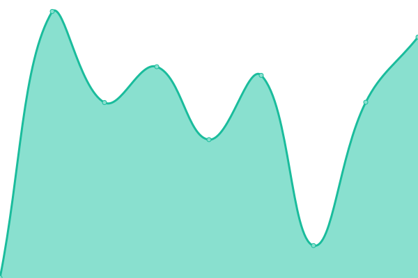
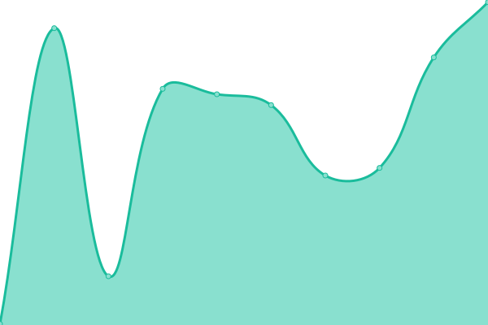
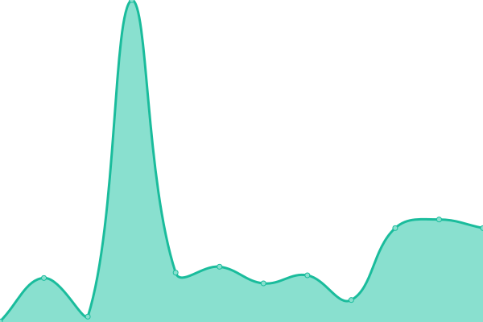
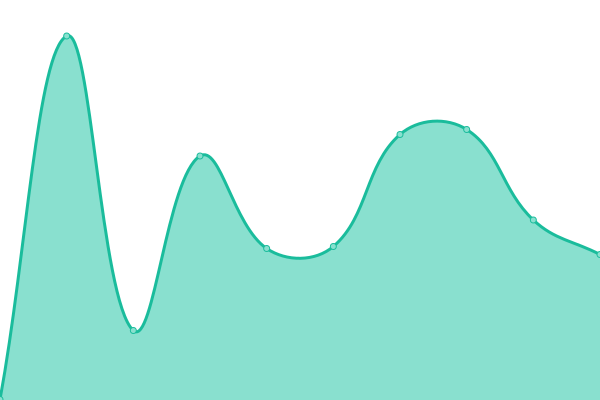

# [📈 Live Status](https://demo.upptime.js.org): <!--live status--> **🟧 Partial outage**

This repository contains the open-source uptime monitor and status page for [𝓥𝓮𝔁𝓣𝓱𝓮𝓟𝓻𝓸𝓽𝓸𝓰𝓮𝓷](https://demo.upptime.js.org), powered by [Upptime](https://github.com/upptime/upptime).

With [Upptime](https://upptime.js.org), you can get your own unlimited and free uptime monitor and status page, powered entirely by a GitHub repository. We use [Issues](https://github.com/zv8001/UT_Status/issues) as incident reports, [Actions](https://github.com/zv8001/UT_Status/actions) as uptime monitors, and [Pages](https://demo.upptime.js.org) for the status page.

<!--start: status pages-->
<!-- This summary is generated by Upptime (https://github.com/upptime/upptime) -->
<!-- Do not edit this manually, your changes will be overwritten -->
<!-- prettier-ignore -->
| URL | Status | History | Response Time | Uptime |
| --- | ------ | ------- | ------------- | ------ |
|  [UT Site](https://unknown-technologies.us) | 🟩 Up | [ut-site.yml](https://github.com/zv8001/UT_Status/commits/HEAD/history/ut-site.yml) | 

 332ms
     
 | 

<a href="https://status.unknown-technologies.us/history/ut-site">100.00%</a>
    

|  [Service 1 (MAIN)](https://api.unknown-technologies.us/) | 🟩 Up | [service-1-main.yml](https://github.com/zv8001/UT_Status/commits/HEAD/history/service-1-main.yml) | 

 205ms
     
 | 

<a href="https://status.unknown-technologies.us/history/service-1-main">91.67%</a>
    

|  [Service 2 (SUB MAIN)](https://api.unknown-technologies.us/booster/health) | 🟩 Up | [service-2-sub-main.yml](https://github.com/zv8001/UT_Status/commits/HEAD/history/service-2-sub-main.yml) | 

 70ms
     
 | 

<a href="https://status.unknown-technologies.us/history/service-2-sub-main">91.68%</a>
    

|  [Service 3 (Transcript System)](https://transcript.unknown-technologies.us/) | 🟩 Up | [service-3-transcript-system.yml](https://github.com/zv8001/UT_Status/commits/HEAD/history/service-3-transcript-system.yml) | 

 352ms
     
 | 

<a href="https://status.unknown-technologies.us/history/service-3-transcript-system">91.70%</a>
    

|  [Service 4 (Web Console)](https://api.unknown-technologies.us/console/) | 🟥 Down | [service-4-web-console.yml](https://github.com/zv8001/UT_Status/commits/HEAD/history/service-4-web-console.yml) | 

 58ms
     
 | 

<a href="https://status.unknown-technologies.us/history/service-4-web-console">11.92%</a>
    

|  [Service 5 (GBS api)](https://api.unknown-technologies.us/gbs/health) | 🟩 Up | [service-5-gbs-api.yml](https://github.com/zv8001/UT_Status/commits/HEAD/history/service-5-gbs-api.yml) | 

 49ms
     
 | 

<a href="https://status.unknown-technologies.us/history/service-5-gbs-api">91.73%</a>
    

|  [Service 6 (gbs webpanel)](https://gbs.unknown-technologies.us/) | 🟩 Up | [service-6-gbs-webpanel.yml](https://github.com/zv8001/UT_Status/commits/HEAD/history/service-6-gbs-webpanel.yml) | 

 169ms
     
 | 

<a href="https://status.unknown-technologies.us/history/service-6-gbs-webpanel">91.74%</a>
    

<!--end: status pages-->

[**Visit our status website →**](https://demo.upptime.js.org)

## 📄 License

- Powered by: [Upptime](https://github.com/upptime/upptime)
- Code: [MIT](./LICENSE) © [Anand Chowdhary](https://anandchowdhary.com), supported by [Pabio](https://pabio.com)
- Data in the `./history` directory: [Open Database License](https://opendatacommons.org/licenses/odbl/1-0/)
